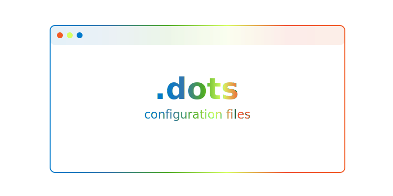

<div align="left"><a id="top"></a>

<!-- 

<p align="center">

#### ◎ Config files and utility scripts

</p> -->

```console
██████   ██████  ████████ ███████
██   ██ ██    ██    ██    ██
██   ██ ██    ██    ██    ███████
██   ██ ██    ██    ██         ██
██████   ██████     ██    ███████

◎ Config files and utility scripts
```


</div>


## Overview

This repository contains configuration files and bash scripts to automate various development tasks. The files are organized into directories based on categories like Python, Git, Zsh, and more.

###  Project Structure

The repository is structured as follows:

```sh
└── dots/
    ├── bash
    │   ├── builds
    │   │   ├── docker_hub.sh
    │   │   └── pypi.sh
    │   ├── common
    │   │   ├── clean.sh
    │   │   ├── run.sh
    │   │   └── test.sh
    │   ├── file-ops
    │   │   ├── aggregate_docs.sh
    │   │   ├── chunk_docs.sh
    │   │   ├── modify_filenames.sh
    │   │   └── move_directory.sh
    │   ├── install
    │   │   ├── local_dependencies.sh
    │   │   ├── local_dependencies_uninstall.sh
    │   │   ├── micromamba.sh
    │   │   └── pyflink.sh
    │   └── project-setup
    │       ├── create_directory_structure.sh
    │       ├── create_python_project.sh
    │       └── tree_to_directory.sh
    ├── git
    │   ├── .gitcommit_template
    │   ├── .gitconfig
    │   ├── .gitignore
    │   └── .gitignore_global
    ├── make
    │   ├── Makefile-poetry
    │   └── Makefile-uv
    ├── python
    │   ├── .ruff.toml
    │   ├── pyproject.toml
    │   └── pytest.ini
    ├── vscode
    │   └── settings.json
    └── zsh
        ├── .zprofile
        └── .zshrc
```

### Project Index

Select a submodule to explore its contents:

<details open>
	<summary><b><code>DOTS/</code></b></summary>
	<details> <!-- python Submodule -->
		<summary><b>python</b></summary>
		<blockquote>
			<table>
			<tr>
				<td><b><a href='https://github.com/eli64s/dots/blob/master/python/pytest.ini'>pytest.ini</a></b></td>
				<td>Configure pytest settings for test coverage and reporting, ensuring tests meet a minimum coverage threshold.</td>
			</tr>
			<tr>
				<td><b><a href='https://github.com/eli64s/dots/blob/master/python/pyproject.toml'>pyproject.toml</a></b></td>
				<td>- Generates README files using large language model APIs, enhancing developer productivity and documentation quality<br>- Integrates with various tools for seamless workflow automation and markdown generation<br>- Facilitates efficient project communication and collaboration through standardized README templates.</td>
			</tr>
			<tr>
				<td><b><a href='https://github.com/eli64s/dots/blob/master/python/.ruff.toml'>.ruff.toml</a></b></td>
				<td>Define codebase linting and formatting rules using the provided configuration file for Python projects.</td>
			</tr>
			</table>
		</blockquote>
	</details>
	<details> <!-- make Submodule -->
		<summary><b>make</b></summary>
		<blockquote>
			<table>
			<tr>
				<td><b><a href='https://github.com/eli64s/dots/blob/master/make/Makefile-poetry'>Makefile-poetry</a></b></td>
				<td>- Manage Poetry environment, install dependencies, and generate requirements files for main and development dependencies<br>- Display help information for Makefile targets.</td>
			</tr>
			<tr>
				<td><b><a href='https://github.com/eli64s/dots/blob/master/make/Makefile-uv'>Makefile-uv</a></b></td>
				<td>- Facilitates installation and management of project dependencies using the uv tool<br>- Includes commands for installing dependencies in editable mode, locking dependencies, syncing environment, creating a virtual environment, and displaying help information<br>- Enhances project development workflow by streamlining dependency handling tasks.</td>
			</tr>
			</table>
		</blockquote>
	</details>
	<details> <!-- zsh Submodule -->
		<summary><b>zsh</b></summary>
		<blockquote>
			<table>
			<tr>
				<td><b><a href='https://github.com/eli64s/dots/blob/master/zsh/.zshrc'>.zshrc</a></b></td>
				<td>- Sets up the interactive shell environment by configuring themes, plugins, aliases, functions, paths, and integrations<br>- Loads scripts, sets history settings, and enables FZF keybindings<br>- Includes custom functions and autocomplete settings for enhanced shell usage within the project architecture.</td>
			</tr>
			<tr>
				<td><b><a href='https://github.com/eli64s/dots/blob/master/zsh/.zprofile'>.zprofile</a></b></td>
				<td>- Sets up the development environment for login shells by configuring paths and environment variables<br>- Includes settings for Homebrew, Python development, local binaries, XDG Base Directory Specification, and development directories<br>- This file plays a crucial role in ensuring a consistent and efficient development setup across the codebase architecture.</td>
			</tr>
			</table>
		</blockquote>
	</details>
	<details> <!-- vscode Submodule -->
		<summary><b>vscode</b></summary>
		<blockquote>
			<table>
			<tr>
				<td><b><a href='https://github.com/eli64s/dots/blob/master/vscode/settings.json'>settings.json</a></b></td>
				<td>- Configures various settings for the Visual Studio Code editor, including themes, font sizes, language-specific formatters, and extensions<br>- Manages preferences for workbench, editor, terminal, Git, file associations, and language-specific settings<br>- Enhances productivity by customizing the editor environment for efficient coding and collaboration.</td>
			</tr>
			</table>
		</blockquote>
	</details>
	<details> <!-- git Submodule -->
		<summary><b>git</b></summary>
		<blockquote>
			<table>
			<tr>
				<td><b><a href='https://github.com/eli64s/dots/blob/master/git/.gitcommit_template'>.gitcommit_template</a></b></td>
				<td>Define commit message template for clear and concise communication of changes made in the project.</td>
			</tr>
			<tr>
				<td><b><a href='https://github.com/eli64s/dots/blob/master/git/.gitignore_global'>.gitignore_global</a></b></td>
				<td>Defines global Git ignore rules for common editor and system files to maintain a clean repository structure.</td>
			</tr>
			<tr>
				<td><b><a href='https://github.com/eli64s/dots/blob/master/git/.gitconfig'>.gitconfig</a></b></td>
				<td>Configure Git settings for streamlined collaboration and efficient version control.</td>
			</tr>
			</table>
		</blockquote>
	</details>
	<details> <!-- bash Submodule -->
		<summary><b>bash</b></summary>
		<blockquote>
			<details>
				<summary><b>install</b></summary>
				<blockquote>
					<table>
					<tr>
						<td><b><a href='https://github.com/eli64s/dots/blob/master/bash/install/micromamba.sh'>micromamba.sh</a></b></td>
						<td>- Facilitates seamless installation and setup of Micromamba, a lightweight package manager, by determining the OS, downloading the latest version, making it executable, moving it to a global path, initializing it, and configuring default channels<br>- This script streamlines the process for users to easily utilize Micromamba across different operating systems.</td>
					</tr>
					<tr>
						<td><b><a href='https://github.com/eli64s/dots/blob/master/bash/install/local_dependencies_uninstall.sh'>local_dependencies_uninstall.sh</a></b></td>
						<td>- Perform local environment cleanup by uninstalling various dependencies like pyenv, goenv, Node.js, Poetry, Git, Git LFS, kubectl, kubectx, and Helm<br>- Additionally, clean up configuration files to ensure a fresh start<br>- The script logs each step and the total cleanup time, providing a streamlined process for resetting the local environment.</td>
					</tr>
					<tr>
						<td><b><a href='https://github.com/eli64s/dots/blob/master/bash/install/pyflink.sh'>pyflink.sh</a></b></td>
						<td>- Automates PyFlink setup by checking and installing Java 11, Python 3.7, and downloading PyFlink<br>- Sets environment variables and aliases for zsh, enabling easy PyFlink usage<br>- Streamlines the initial setup process for PyFlink integration within the project architecture.</td>
					</tr>
					<tr>
						<td><b><a href='https://github.com/eli64s/dots/blob/master/bash/install/local_dependencies.sh'>local_dependencies.sh</a></b></td>
						<td>- Automates local environment setup by installing essential tools like Oh My Zsh, Homebrew, pyenv, Go, kubectl, Helm, Node.js, Poetry, Git, and Git LFS<br>- Updates shell configurations for seamless tool integration, ensuring a smooth development experience<br>- Logs installation progress and completion time for user reference.</td>
					</tr>
					</table>
				</blockquote>
			</details>
			<details>
				<summary><b>file-ops</b></summary>
				<blockquote>
					<table>
					<tr>
						<td><b><a href='https://github.com/eli64s/dots/blob/master/bash/file-ops/chunk_docs.sh'>chunk_docs.sh</a></b></td>
						<td>Automates the process of chunking a document into 10 parts for easier management and navigation within the project's documentation structure.</td>
					</tr>
					<tr>
						<td><b><a href='https://github.com/eli64s/dots/blob/master/bash/file-ops/aggregate_docs.sh'>aggregate_docs.sh</a></b></td>
						<td>- Aggregate markdown files from a GitHub repository into a single document based on specified paths<br>- Clone the repository, search for markdown files, concatenate their content, and output a consolidated markdown file<br>- Handles various input parameters to customize the aggregation process.</td>
					</tr>
					<tr>
						<td><b><a href='https://github.com/eli64s/dots/blob/master/bash/file-ops/modify_filenames.sh'>modify_filenames.sh</a></b></td>
						<td>- The code file modifies filenames in a specified directory by converting them to lowercase and replacing underscores with hyphens<br>- This script helps maintain consistency in file naming conventions within the project structure.</td>
					</tr>
					<tr>
						<td><b><a href='https://github.com/eli64s/dots/blob/master/bash/file-ops/move_directory.sh'>move_directory.sh</a></b></td>
						<td>Moves a specified folder to a destination directory if both exist; otherwise, displays appropriate error messages.</td>
					</tr>
					</table>
				</blockquote>
			</details>
			<details>
				<summary><b>builds</b></summary>
				<blockquote>
					<table>
					<tr>
						<td><b><a href='https://github.com/eli64s/dots/blob/master/bash/builds/docker_hub.sh'>docker_hub.sh</a></b></td>
						<td>- Automates building, pushing, and publishing Docker images using Buildx<br>- Sets up Docker Buildx, builds and pushes a single-platform image, then builds and pushes a multi-platform image<br>- Displays the completion message with the published image name.</td>
					</tr>
					<tr>
						<td><b><a href='https://github.com/eli64s/dots/blob/master/bash/builds/pypi.sh'>pypi.sh</a></b></td>
						<td>- Automates PyPI package deployment by cleaning, building, and uploading distribution files<br>- Integrates with PyPI API for seamless deployment of 'my-package'.</td>
					</tr>
					</table>
				</blockquote>
			</details>
			<details>
				<summary><b>project-setup</b></summary>
				<blockquote>
					<table>
					<tr>
						<td><b><a href='https://github.com/eli64s/dots/blob/master/bash/project-setup/create_python_project.sh'>create_python_project.sh</a></b></td>
						<td>- Creates essential project directories, files, and configuration settings for a Python project<br>- Sets up project structure, including source code, tests, and configuration files<br>- Establishes a foundation for building and running the project with necessary components like logger, configuration classes, and main script.</td>
					</tr>
					<tr>
						<td><b><a href='https://github.com/eli64s/dots/blob/master/bash/project-setup/tree_to_directory.sh'>tree_to_directory.sh</a></b></td>
						<td>- Generates project directory structure and essential files for a vector SVG generator tool<br>- Organizes core, templates, API, CLI, utils, tests, assets, docs, configs, examples, and root files<br>- Ensures a well-structured foundation for the project setup.</td>
					</tr>
					<tr>
						<td><b><a href='https://github.com/eli64s/dots/blob/master/bash/project-setup/create_directory_structure.sh'>create_directory_structure.sh</a></b></td>
						<td>- Generates a directory structure for a markdown guide in the specified base directory<br>- The script creates directories and files based on the predefined structure, ensuring proper organization for markdown content<br>- This functionality aids in setting up a consistent and easily navigable layout for the markdown guide within the project architecture.</td>
					</tr>
					</table>
				</blockquote>
			</details>
			<details>
				<summary><b>common</b></summary>
				<blockquote>
					<table>
					<tr>
						<td><b><a href='https://github.com/eli64s/dots/blob/master/bash/common/run.sh'>run.sh</a></b></td>
						<td>- Automate environment setup and package upgrades in the project by running the provided bash script<br>- The script activates the specified conda environment, upgrades pip, and logs the execution start and completion timestamps<br>- This ensures a consistent and up-to-date development environment for the codebase.</td>
					</tr>
					<tr>
						<td><b><a href='https://github.com/eli64s/dots/blob/master/bash/common/clean.sh'>clean.sh</a></b></td>
						<td>- The clean.sh script provides commands to remove various artifacts like build, test, and Python files from the project directory<br>- It helps maintain a clean and organized codebase by removing unnecessary files and directories.</td>
					</tr>
					<tr>
						<td><b><a href='https://github.com/eli64s/dots/blob/master/bash/common/test.sh'>test.sh</a></b></td>
						<td>- Executes test coverage analysis for the project by running pytest with coverage reporting<br>- It activates the 'readmeai' conda environment, sets source and omit directories, and generates coverage reports<br>- The script ensures test coverage meets a minimum threshold for quality assurance.</td>
					</tr>
					</table>
				</blockquote>
			</details>
		</blockquote>
	</details>
</details>

---

## Installation

To get started with the utility scripts, build the project from source:

1. Clone the repository:
```sh
❯ git clone https://github.com/eli64s/dots
```

2. Navigate to the project directory:
```sh
❯ cd dots
```

## Running the Scripts

One of my favorite scripts to use right now is [aggregate_docs.sh](bash/file-ops/aggregate_docs.sh), which concatenates all files from a GitHub repository into a single file. I've found this script useful when working with language model APIs for providing the model with robust context and up-to-date information.

First, let's view the help message for the script:

```sh
❯ bash bash/file-ops/aggregate_docs.sh -h

Usage: bash/file-ops/aggregate_docs.sh [-r REPO_URL] [-p POSSIBLE_PATHS] [-o OUTPUT_FILE] [-n REPO_NAME] [-s TO_SEARCH]
  -r REPO_URL       URL of the GitHub repository to clone (required)
  -p POSSIBLE_PATHS Comma-separated list of possible paths to search for markdown files (required)
  -o OUTPUT_FILE    Name of the output markdown file (required)
  -n REPO_NAME      Name of the repository (required)
  -s TO_SEARCH      Pattern to search for markdown files (e.g., "*.md") (required)
```

To run the script, provide the following arguments:

```sh
❯ bash bash/file-ops/aggregate_docs.sh \
    -r https://github.com/pydantic/pydantic \
    -n pydantic \
    -o pydantic-docs.md \
    -p docs \
    -s "*.md"
```

Alternatively, make the script executable:

```sh
❯ chmod +x bash/file-ops/aggregate_docs.sh
```

And run it directly:

```sh
❯ ./aggregate_docs.sh \
    -r https://github.com/pydantic/pydantic \
    -p docs \
    -o pydantic-docs.md \
    -n pydantic \
    -s "*.md"
```

## Advanced Configuration

Say you want to clone this repository and use the `.zshrc` file as your shell configuration, and have quick access to the function under the `bash` directory. We can set this up by creating symlinks from the repository to your home directory.

1. Create symlinks from your repository to your home directory:

	```sh
	# Current repository location
	❯ DOTS_DIR="/Users/<username>/GitHub/dots"

	# Create symlinks
	❯ ln -sf "$DOTS_DIR/zsh/.zshrc" "$HOME/.zshrc"
	❯ ln -sf "$DOTS_DIR/bash" "$HOME/.zsh/functions"
	```

2. Add the following line to your `.zshrc` file to source the utility scripts:

	```zsh
	# -- GitHub/dots Repository Integration ---------------------------------------------
	DOTS_DIR="$HOME/Documents/GitHub/dots"
	DOTS_SCRIPTS="$DOTS_DIR/bash"

	# Function to load scripts from directory
	function load_scripts() {
		local dir="$1"
		if [ -d "$dir" ]; then
			# Create functions for all scripts instead of aliases
			for script in "$dir"/*.sh; do
				if [ -f "$script" ]; then
					local func_name=$(basename "$script" .sh)
					eval "function $func_name() { $script \"\$@\" }"
				fi
			done
		fi
	}

	# Load all script directories from dots/bash
	for category in $DOTS_SCRIPTS/*; do
		if [ -d "$category" ]; then
			load_scripts "$category"
		fi
	done

	# Add custom functions directory to fpath
	fpath+=("$DOTS_DIR/zsh/functions")
	```

3. Now you can run the scripts directly from your terminal:

	```sh
	❯ aggregate_docs -r https://github.com/pydantic/pydantic-ai \
			 -p docs \
			 -o pydantic-ai-docs.md \
			 -n pydantic-ai \
			 -s "*.md"
	```

This setup maintains the repository structure while making all bash scripts accessible as commands in your shell.

> [!TIP]
> The [bash scripts][dots.bash] directory contains a variety of scripts for automating tasks like environment setup, file operations, and codebase management.

<div align="left">
    <a href="#top">
        
    </a>
</div>

---

<!-- REFERENCE LINKS -->

[dots.bash]: https://github.com/eli64s/dots/tree/main/bash